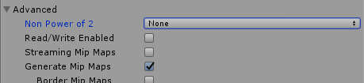

Unity SSPattern
===============

Unity SSPattern is a Screen Space Pattern shader and companion script that makes the pattern follow the shaded object.

Features
--------

 - Pattern following the object
 - Pattern sacles when zooming in and out
 - Support for multiple cameras

Download
--------

A unity package is available in the relase section : [SsPattern v1.0](https://github.com/eliemichel/UnitySsPattern/releases/download/v1.1/UnitySsPattern-v1.0.unitypackage)

Usage
-----

1. Add the `SSPatternController` to the **cameras** that must support the effect.
2. Create a material of type "FX/SsPattern" an assign it to any object.

You can checkout the scene `Example/Example` for an example of use.

Troubleshooting
---------------

If you notice some stretching with non-square textures, go to the texture's import settings and set "Non Power of 2" to `None`:

